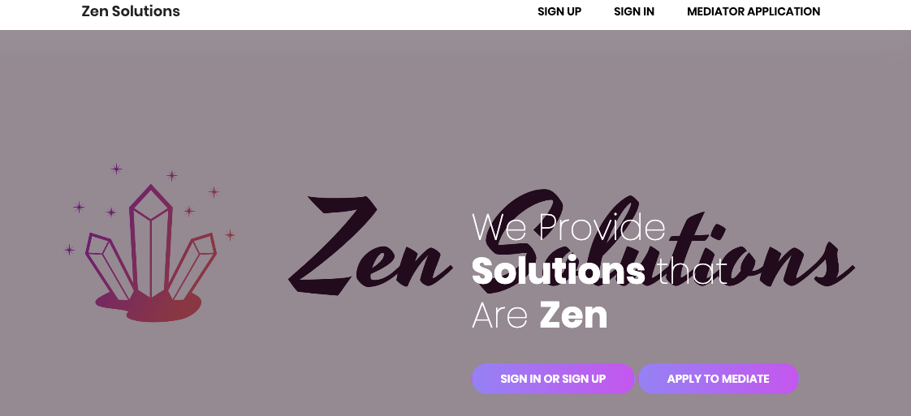

# Zen-Solutions

I have created Zen Solutions (a full stack application) with HTML, CSS, JS, NODE.JS and MongoDB. 

Zen Solutions is an online solutions handler aka online mediation. 

I have created this application due to my passion and history with mediation. You can apply to be a mediator, sign in and sign out (as a client or mediator). 

Both parties are able to take notes and handle appointment requests. 

DISCLAIMER:

I plan to add more and there are some aspects that I am contemplating adding! 

Happy Mediating :)
